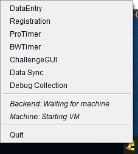

# Very First Time Ever On Windows
1. Download WindowsEnvironmentValidate.ps1 from <https://github.com/drytoastman/scorekeeperfrontend/releases> to your computer
2. Right click on the file and select "Run with PowerShell", it will ask for Administrator priveleges
3. If all 6 reporting lines are green, you are good to go.
4. If one of the first two items are red, a webpage will be opened for each for you to download and install the necessary software
    * Java 8
    * Docker (Docker-Toolbox for most Windows machines)

# First Time With a New Release
1. Down the latest release jar file from <https://github.com/drytoastman/scorekeeperfrontend/releases>
2. Double Click on the Jar File and a cone icon should show up in your tray.
3. Right click on the icon to see the available applications as well as the status of the backend.
4. On Windows, if you haven't started the docker virtual machine since the last boot, the Machine status will say: Starting VM.  This can take about 60 seconds.

5. The scorkeeeper tray monitor will now download the matching backend container images with the Backend status reporting each of the following in some order:
    * Init scweb
    * Init scsync
    * Init scdb
6. Eventually the Backend status should report as "Running".  Everything should be ready to go.

# Notes on Application Use

1. Starting and stopping the TrayMonitor should be quick as the VM is left running.  The only long delay is starting the VM after a reboot on Windows machines.
2. All Scorekeeper applications can be started from the TrayMonitor.  No need to create shortcuts that end up invalid after an upgrade.
3. If the TrayMonitor isn't running, the database is 99% most likely not running so applications needing it won't work anyhow.
4. The database and log storage are linked to the jar version and logged in user.  Changing versions or users will be using different data.

# Downloading Data

1. Right click on the TrayMonitor and select "Data Sync"
2. For series not present on the local machine:
    * Select "Download New Series From" from the "Sync" menu
    * Select the "scorekeeper.wwscc.org" from the host entry
    * It will download the available series and you can select from those in the Series entry
    * Enter the password for the series and click "Verify Password"
    * If the password is correct, the button will change to "Download".  Click and let it finish.
3. For series already present
    * For series already present, select "Sync With Host Now"
    * Select the host from the host entry, click OK and let the sync finish.
4. Any red boxes in the status table indicate something out of date or not having the same data.

# Collecting Debug Data

The TrayMonitor contains a command "Debug Collection".  This will collect all the frontend logs, backend logs and the database data itself and put it into a zipfile
that can be sent to me for figuring out what broke.

