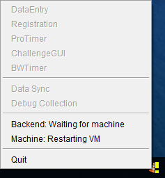

# Installing
## Windows Home
1. If the computer is used for things other than Scorekeeper, you may wish to create a user just for Scorekeeper
2. Download the latest ScorekeeperSetup installer from <https://github.com/drytoastman/scorekeeperfrontend/releases> 
    * The installer may foward you to websites to install Java 8 and/or Docker-Toolbox if they are not present already
3. The installer will perform all setup and put an entry in the startup folder so that its starts when you login
    * This version has to run a virtual machine which takes about 60 seconds to startup after logging in

## x64 Linux, OS X, Windows Pro (anything with Docker + Java 8)
1. There is no installer at this point so you need to do a few things manually
2. Verify that the following requirements are met:
    * Java 8 (including openjfx if using openjdk)
    * Docker
3. Download the latest Scorekeeper jar from <https://github.com/drytoastman/scorekeeperfrontend/releases> to your computer
4. Setup a way to run "java -jar scorekeeper-<VERSION>.jar" to start Scorekeeper and run it now
5. The first time you run a new version it will download the necessary docker images, showing the status as it does so:
    * Init scweb
    * Init scsync
    * Init scdb
6. Eventually the Backend status should report as "Running".  Everything should be ready to go.
7. You may need to open incoming firewall ports depending on use:
    * **TCP:80**    for the local web server (results, etc)    
    * **UDP:5454**  for discovering nearby machines or network timers
    * **TCP:54329** for syncing with other nearby machines
    * **TCP:54328** for most network timer connections
    

# Notes on Application Use

1. Starting and stopping the TrayMonitor should be quick as the containers are quick to start and stop.
2. The only long delay is on Windows Home when restarting the virtual machine after a reboot or logoff

3. All Scorekeeper applications should be started from the TrayMonitor menu
4. If the TrayMonitor isn't running, the database is 99% most likely not running so applications will not work
5. For consistency, each Scorekeeper version is assigned its own storage 'folder'
    * Upgrading versions or changing users will use different data

# Collecting Debug Data

The TrayMonitor contains a menu item "Debug Collection".  This will collect all the frontend logs, backend logs and the database data itself and put it into a zipfile
that can be sent to me for figuring out what broke.

