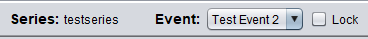
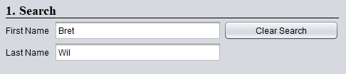
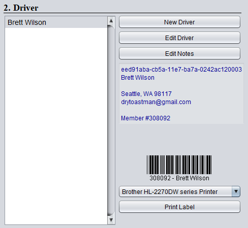
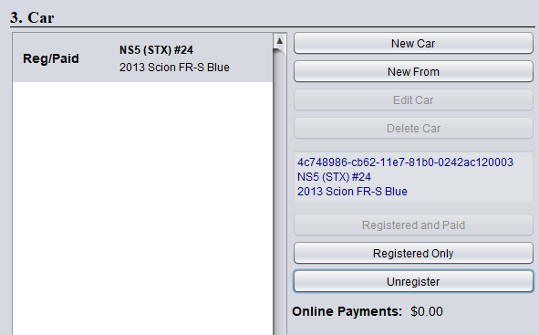

# Registration

## Initial download or sync

Download/Merge from the [sync tool int the status window](sync.md)

## Setup Verification 

Select the event you are administering. You can check the Lock checkbox to disable event selection so that
accidental event selection does not occur during registration activity.

## Standard Actions

1. Enter part of the first and/or last name.  More information produces a shorter list of drivers in the next step.

2. Select the driver from the list of drivers.  
    * If the name is not present, you must click New Driver to create a new driver entry 

3. You can **Edit Driver** to update the member information
    * The membership number is important if you intend to use barcode scanning 
    * If a barcode is needed, click Print Label to print to the selected printer device - make sure correct printer is selected.

4. Verify the correct car(s), class(es) and index are registered. 
    * Default status for preregistered drivers is **Registered** or **Reg/Paid** if they paid online
    * Cars can be created, edited or deleted. 
        * **New From** prefills the data with the selected car - which can then be edited as needed (saves having to enter all car info if only needs a different class or car number) 
    * To change a car entry, select it and click **Registered** and **Paid**, **Registered Only** or **Unregister**
        * **Registered** means the car was registered but has not been paid for yet
        * **Reg/Paid** means that the car was registered and marked as paid
        * **In Event** means the car already has times recorded in the event
        * **Other** means that the car is registered or has runs in another event
    * Entries that are not marked as **Reg/Paid** can be flagged in data entry, and pulled out of the grid line

## Merging

If select multiple cars that have the same class and index, a merge button will appear that merges the cars together.
The same option does not exist for drivers as the data is shared between other series on the main server so the merge
operation for drivers is only provided via the admin website.

## Syncing databases

Take laptops where they are in network range of the data entry machine and [sync via the scorekeeper status window again](sync.md)

