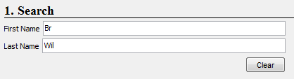
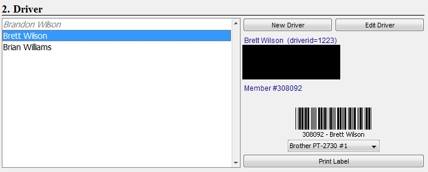
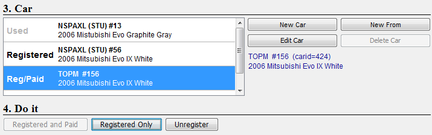
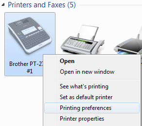
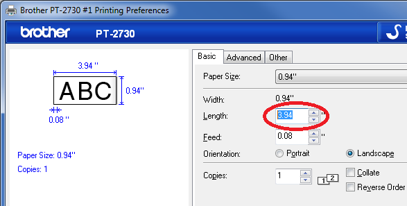

# Before the Event
1. Download/Merge using the [DataSync tool from the TrayMonitor](datasync.md)

# During Registration

## Setup Verification 
You can check the Lock checkbox to disable event selection so that accidental event selection does not occur during registration activity

## Weekend memberships (1 worker)
* Fill out weekend member forms as usual - give driver pink copy - give new checkered wristband.

## Computers/printers (2 workers)
**one line for changes and one line for no changes - adjust as necessary**

**All Drivers - Check for valid driver's license and SCCA membership (annual or weekend)**

1. Enter part of the first and/or last name.  More information produces a shorter list of drivers in the next step.

2. Select the driver from the list of drivers.  
    * If the name is grey italic or not present, you must click New Driver to create a new driver entry 
    * If need to create New Driver - enter name/email/member# only

3. Verify the driver's member number for barcode
    * You can **Edit Driver** to update the member # information
    * SCCA annual members
        * verify SCCA member number is in driver profile and correct
    * Weekend members
        * If HAS a driver ID number in profile from previous events - Leave number as is 
        * If DOES NOT have driver ID number in profile - click Edit Driver - enter the last 6 digits of pink form id number as the member number - click update/submit 
    * If a barcode is needed, click Print Label to print to the selected printer device - make sure correct printer is selected.
    * Barcode placement - ask  driver if has own helmet:
        * if yes - explain placement (left side of helmet)
        * if no - tell driver to place on the windshield 

4. Verify the correct car(s), class(es) and index are registered. 
    * Default status for Pre-Reg drivers is Registered. 
    * A driver should NOT have 2 cars registered in the same class - verify which car driver wishes to use and Unregister the other car.
    * If not pre-registered, click on the car the driver wishes to register (if in system) or create a New Car 
    * Cars can be created, edited or deleted. 
        * New From prefills the data with the selected car - which can then be edited as needed (saves having to enter all car info if only needs a different class or car number) 
    * To change a car entry, select it and click Registered and Paid, Registered Only or Unregister
        * Registered means the car was registered but has not paid yet
        * In Event means the car already has times recorded in the event

5. Click Registered and Paid at the bottom and tell driver fee total. 
    * Verify that Reg/Paid is to the left of them. (Driver will pay the cash worker.) NOTE: If drivers are not marked as Reg/Paid they will be flagged in the timing software when their barcode is scanned, and pulled out of the grid line

## Collect fees (1 worker)

* Annual Member fees:
    * $25 pre-reg/$30 non-pre-reg
    * $15 pre-reg first gear/$20 non-pre-reg
    * NOTE: 2nd entry of day is always $25 (or $15 first gear) even if not pre-reg
* Weekend Member fees:
    * $25 + $10 pre-reg
    * $30 + $10 non-pre-reg
    * -$10 (or $25)if has discount card (verify eligibility on computer) add driver to card log (paper)
    * NOTE: 2nd entry of day is always $25 even if not pre-reg

# Merging databases

1. Take laptops where they are in network range of the data entry machine.
TODO

# Configuring Label Printer

By default, the label printer will use about 4" of label material for each label printed.  This can only be changed in the local printing preferences itself.  If it is not already setup:

1. Right click on the printer and select "Printing Preferences" (Windows 7)

2. In the preferences dialog, change the Length field, we currently use 2.3".

# Tasha's FAQ's

1. If an entrant is registered for two classes at the same event, <class> and TOPM, and it is the AM session where <class> is running, does registration need to do anything to make sure the entrant's <class> entry info is used first?

    * No, if multiple cars are registered, TOPM is only used once all other cars have been used in other run groups.  Data Entry can also override if they need to.

2. If an entrant is running <class> and also registered for TOPM, but <class> runs PM so the TOPM entry isn't allowed/needed. What does registration need to do to make sure the correct entry is used in this situation?

    * Nothing is required; however, you can unregister the TOPM if you wish.

3. For an entrant who is correctly pre-registered for AM and PM and has no changes, does registration need to do anything besides verify entry info and make sure the entrant has a barcode?

    * No, they are ready to go

