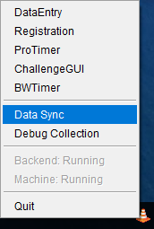

# Data Synchronization

You can open the DataSynchronization window by right clicking on the TrayMonitor and selecting **Data Sync**.

The tables in the windows contains the lists of active hosts and inactive hosts.  The first host in the active
table is always the local machine.  Other active hosts will include those discovered locally that we are still
in contact with and any remote hosts that are processing a sync request from the user.

Any red boxes in the status table indicate something of potential interest.  A red time value indicates that the
time is far enough in the past that we may no longer be in sync but we do not know for sure.  A red value in one
of the series columns indicates that an error occured or that the remote version of the series is in a different
state from the local machine.  The seemingly random data under the series columns are actually part of a hash
calculation of the series contents.

# With scorekeeper.wwscc.org

## Downloading a New Series
1. Click **Download New Series From scorekeeper.wwscc.org**
1. Remote series that are not present on the machine will be loaded, after which you can select one
1. Enter the password for the series and click **Verify Password**
1. If the password is correct, the button will change to **Download**, otherwise try the password again
1. Click **Download** and let it finish

## Syncing A Series
1. Click **Sync With scorekeeper.wwscc.org**

# With Other Hosts

